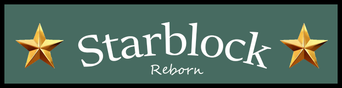

This plugin is now supported in [Godot Extended Library Discord](https://discord.gg/JNrcucg), check out the [Godot Extended Library Project](https://github.com/godot-extended-libraries)!

# Starblock Reborn
A Re-Imagining of the not-very-good original Starblock. Now written in Godot!

Author: *"Peter LaMontagne"*  
Version: *"Pre-Alpha"* 
Godot Version: *3.2stable*  

